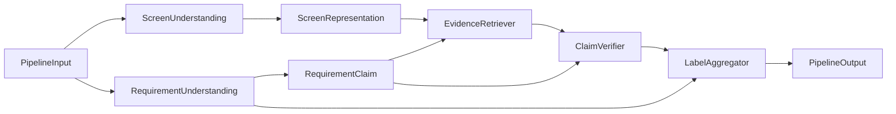

# Evidence-First Verification Pipeline

This package is the first modular skeleton for verifying textual UI requirements against ordered screenshot flows.
It is intentionally conservative: no `FULFILLED` label is emitted without visible evidence.

## Pipeline



## Modules

- `schemas.py`: Pydantic v2 models for screenshots, screen representations, requirements, claims, evidence, claim results, requirement results, and pipeline input/output.
- `screen_understanding.py`: Loads image metadata, preserves `step_index`, reads optional OCR or summary sidecars, extracts already available text from Mind2Web `steps.json` HTML, and returns `ScreenRepresentation`.
- `requirement_understanding.py`: Heuristic UI evaluability classifier and claim decomposition wrapper. It reuses the existing `ui_verifier.requirements.claim_decomposition` code.
- `evidence_retrieval.py`: Strategy-based retrieval with lexical default, optional TF-IDF if `sklearn` is installed, and optional local embedding retrieval if `sentence-transformers` and a local model path are available.
- `claim_verification.py`: Rule-based placeholder verifier. It supports strong, weak, missing, and hidden evidence cases but does not invent contradictions.
- `label_aggregation.py`: Deterministic label gates enforcing the evidence-first policy.
- `pipeline.py`: Dependency-injected orchestration so Gemini, OCR, retrieval, and fine-tuned components can be swapped in later.

## CLI

```bash
python scripts/run_verification_pipeline.py \
  --flow-dir data/processed/flows/mind2web/<flow_id> \
  --requirements requirements.json \
  --out data/generated/verification_pipeline/<flow_id>.json \
  --retriever lexical \
  --top-k 3
```

`--retriever` supports `lexical`, `tfidf`, and `embedding`. TF-IDF and embedding retrieval fall back safely when optional libraries or local models are unavailable.

Claim decomposition is heuristic by default. To use a fast optional LLM fallback only for requirements where heuristic decomposition looks weak, pass:

```bash
python scripts/run_verification_pipeline.py \
  --flow-dir data/processed/flows/mind2web/<flow_id> \
  --requirements requirements.json \
  --out data/generated/verification_pipeline/<flow_id>.json \
  --llm-claim-fallback \
  --claim-model gemini-2.5-flash-lite
```

The fallback reuses the existing Gemini wrapper and sends failed decomposition cases in one batch. It is never required for tests or offline execution.

## Input Example

```json
{
  "requirements": [
    {
      "requirement_id": "REQ-01",
      "text": "The system shall show a checkout summary including subtotal, tax, and total."
    }
  ]
}
```

The CLI also accepts a plain list of requirement objects or a list of strings.

## Output Example

```json
{
  "flow_id": "example_flow",
  "results": [
    {
      "requirement_id": "REQ-01",
      "requirement_text": "The system shall show a checkout summary including subtotal, tax, and total.",
      "ui_evaluability": "UI_VERIFIABLE",
      "final_label": "PARTIALLY_FULFILLED",
      "claims": [
        {
          "claim_id": "REQ-01-C1",
          "claim_text": "The system shows a checkout summary.",
          "status": "SUPPORTED",
          "evidence": [
            {
              "step_index": 3,
              "screenshot_path": "step_03.png",
              "visible_observation": "lexical matched score 0.667 on visible terms: checkout, summary.",
              "confidence": 0.667,
              "source": "lexical"
            }
          ],
          "uncertainty_reasons": [],
          "rationale": "Retrieved visible evidence is strong enough for this placeholder verifier."
        }
      ],
      "evidence": [],
      "uncertainty_reasons": ["FLOW_COVERAGE_GAP"],
      "rationale": "At least one important claim has visible support, but another important claim is missing, hidden, or ambiguous."
    }
  ]
}
```

## Label Rules

- `FULFILLED`: Only when the requirement is UI-verifiable or partially UI-verifiable, all central observable claims are supported or acceptably partially supported, at least one evidence item exists, no claim is contradicted, and no central hidden claim remains unresolved.
- `PARTIALLY_FULFILLED`: At least one important claim is supported or partially supported, while another important claim is missing, hidden, or ambiguous. There must be no central visible contradiction.
- `NOT_FULFILLED`: Only when a central observable claim is contradicted by visible evidence.
- `ABSTAIN`: Used for insufficient screenshots, no useful evidence, not UI-verifiable requirements, hidden properties, backend-only behavior, security, payment processing, email delivery, ranking correctness, long-term persistence, and real-world external effects.

Missing evidence alone is not `NOT_FULFILLED`. No evidence means no `FULFILLED`.

## Dependency Policy

No new dependencies were added for this skeleton. The implementation reuses:

- `pydantic` for structured schemas.
- `pillow` for image metadata.
- Existing argparse script conventions.
- Existing flow helpers and requirement claim decomposition.
- Existing Gemini wrapper when optional LLM claim fallback is explicitly enabled.

Optional TF-IDF and embedding retrievers use guarded imports only. They do not make downloads or network calls during normal execution or tests.

## Current Limitations

- OCR is sidecar-only unless a future component is injected.
- Lexical retrieval is a deterministic fallback, not a semantic verifier.
- The rule-based claim verifier does not detect contradictions.
- Bounding boxes are supported in the schema but not localized yet.
- Screen summaries are placeholders unless sidecar or HTML text exists.

## Future Extensions

- Gemini-based requirement understanding.
- Gemini-based claim verification over screenshots and retrieved evidence.
- OCR integration with text and bounding boxes.
- Embedding reranker over candidate evidence steps.
- Bounding box localization for evidence regions.
- Fine-tuning a UI evaluability classifier.
- Fine-tuning an evidence-step reranker.
- Fine-tuning claim decomposition while preserving the evidence-first output contract.
