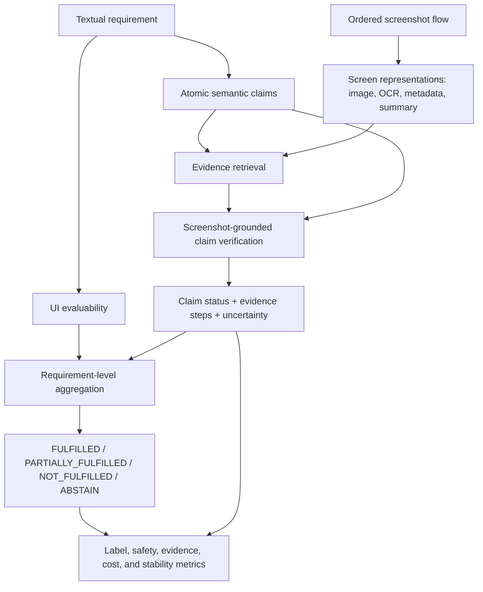

# Thesis Brainstorm, Evidence Map, and Writing Assembly

**Working title:** *Automated UI Requirement Verification from Ordered Screenshot Sequences*
**Snapshot date:** 16 July 2026
**Purpose:** A deliberately broad collection of thesis-ready arguments, current facts, reusable proposal wording, experiment ideas, decisions, caveats, and open work. This is a writing and evidence staging document, not the final thesis and not a frozen result report.

## 0. How to use this document

This document separates four kinds of material that must not be mixed in the final thesis:

1. **Verified current repository facts** are marked as current snapshot facts and point to live data or code.
2. **Preliminary results** are usable only with their exact denominator and configuration.
3. **Historical findings** are useful for hypotheses and error categories but not for final result tables.
4. **Proposed writing or experiments** are brainstorm material, not completed work.

When this document conflicts with an older progress report, use the live annotation files and fresh evaluator output. The most important known stale areas are the PURE counts in `thesis_first_draft.md`, `thesis_first_version_plan.md`, and `thesis_evidence_audit.md`.

## 1. Thesis in one sentence

Textual UI requirement verification from screenshots is not merely a multimodal classification task; it is a traceability, temporal-evidence, and uncertainty task in which the system must connect each verdict to visible states in an ordered flow and refrain from asserting what those states do not establish.

## 2. Strongest defensible thesis story

The strongest current story is not that the evidence-first system already beats simpler prompting. The controlled preliminary Mind2Web results do not show that. The defensible story is:

- UI requirements are textual, but their evidence is visual, stateful, and often distributed across time.
- An ordered screenshot flow provides a concrete but incomplete observation of the system.
- Verification therefore needs an explicit trace from requirement to claim to screenshot step, plus a policy for missing and hidden evidence.
- Whole-flow multimodal prompting is currently a strong label baseline.
- Claim decomposition and evidence retrieval make decisions inspectable and make retrieval failures measurable, even when they do not yet improve label metrics.
- The most important failures are structured: partial evidence is over-generalized, late result states are missed, quantified statements are inferred from examples, and hidden outcomes are treated as visible facts.
- Correct screenshot chronology is theoretically central for transition claims, but the repository does not yet contain the promised ordered-versus-shuffled ablation. This must be presented as an open empirical question until it is run.
- Model output also varies across fresh repetitions even at low or nominally zero temperature. Final reporting must separate evidence uncertainty from run-to-run model variability.

Possible concluding sentence if final experiments remain consistent:

> Ordered screenshot flows make visible UI requirement verification measurable, but they do not eliminate the uncertainty caused by incomplete observation. Whole-flow multimodal models provide a strong label baseline, while explicit claim and evidence structures make decisions traceable and reveal retrieval and reasoning failures. Reliable verification therefore requires both adequate temporal evidence and conservative reasoning about what the observed flow can establish.

## 3. Research questions and where each part of the project fits

The current four research questions remain usable:

### RQ1 — End-to-end label quality

> How accurately can multimodal models verify textual UI requirements from ordered screenshot flows?

Relevant material:

- four-label prediction quality;
- macro-F1 and confusion matrices under class imbalance;
- false-fulfillment rate;
- prediction coverage and abstention;
- model-strength and cost comparison.

### RQ2 — Architecture, evidence, and sequence

> How does evidence-first verification affect label quality, false fulfillment, evidence traceability, and cost compared with whole-flow and deterministic baselines?

Recommended explicit subquestions:

- **RQ2a:** What is gained or lost by top-k evidence selection compared with whole-flow input?
- **RQ2b:** How much does correct screenshot chronology contribute for sequence-sensitive web requirements?
- **RQ2c:** Given frozen claim assessments, does constrained semantic aggregation improve requirement labels over deterministic aggregation without increasing false fulfillment?

RQ2 should remain neutral. “Evidence-first” is an architectural constraint and an inspectability contribution; improved accuracy or safety must be demonstrated rather than assumed.

### RQ3 — Failure modes and reliability

> Which requirement and evidence patterns cause the most frequent errors or abstentions?

Recommended explicit reliability component:

- How stable are labels, claim statuses, and evidence selections across fresh repetitions of the same configuration?

This connects systematic semantic failures with nondeterministic output variation. They are different phenomena and should be measured separately.

### RQ4 — Exploratory transfer to PURE

> As an exploratory question, how well does the approach transfer to structured PURE requirements?

Important qualification: Mind2Web consists of actual ordered web interaction trajectories. PURE UI images are usually document figures or static artifacts, not recorded temporal interaction flows. PURE is therefore best used to study requirement extraction, contextualization, decomposition, visible/hidden boundaries, and document-to-UI consistency. It is not equally strong evidence for the “ordered flow” contribution.

## 4. Conceptual map: how the pieces connect

The important conceptual separation is:

1. **UI evaluability:** Could screenshots in principle resolve the requirement?
2. **Evidence availability:** Does this particular recorded flow contain the needed states?
3. **Claim interpretation:** What does the selected visible evidence support, contradict, or leave unresolved?
4. **Requirement aggregation:** How do several claim results combine into one label?
5. **Run reliability:** Would a fresh execution with identical inputs reach the same intermediate and final outputs?

These separations are useful because a single wrong final label can originate in different places:

- the requirement was not self-contained;
- the claim decomposition dropped a hidden or downstream obligation;
- retrieval omitted a decisive late state;
- the verifier over-interpreted a visible proxy;
- aggregation handled mixed statuses poorly;
- a fresh model call produced a different answer.

## 5. Label system and “research labels”

### 5.1 UI evaluability is not fulfillment

| UI-evaluability label | Question it answers |
|---|---|
| `UI_VERIFIABLE` | Can the requirement's relevant obligations be checked from visible UI evidence? |
| `PARTIALLY_UI_VERIFIABLE` | Is there a visible core plus a hidden, external, persistent, policy, or business-logic component? |
| `NOT_UI_VERIFIABLE` | Is there no stable screenshot-visible manifestation? |

A requirement can be `UI_VERIFIABLE` but still receive `ABSTAIN` because the recorded flow omitted the relevant state. Conversely, a partially UI-verifiable requirement can receive `PARTIALLY_FULFILLED` if a complete visible obligation is supported while another material obligation remains hidden or missing.

### 5.2 Claim statuses

The live implementation uses:

- `SUPPORTED`
- `SUPPORTED_WITH_CAVEAT`
- `PARTIALLY_SUPPORTED`
- `MISSING`
- `CONTRADICTED`
- `HIDDEN`
- `AMBIGUOUS`
- `OUT_OF_SCOPE`

The written label guide currently documents only `SUPPORTED`, `CONTRADICTED`, `MISSING`, `HIDDEN`, `AMBIGUOUS`, and `OUT_OF_SCOPE`. This schema drift must be resolved before final experiments. Otherwise measured “claim status” differences may partly be differences in taxonomy.

An additional idea from the semantic-aggregation review is to keep **evidence basis** orthogonal to status:

- `DIRECT_UI_EVIDENCE`
- `VISIBLE_SUCCESS_PROXY`
- `EXTRAVISUAL_INFERENCE`
- `NO_EVIDENCE`

Status expresses polarity; evidence basis expresses how the status was justified. This is cleaner than overloading `SUPPORTED_WITH_CAVEAT` with every kind of inference.

### 5.3 Final verification labels

| Label | Core decision rule |
|---|---|
| `FULFILLED` | All central observable claims are supported, positive evidence exists, no visible contradiction exists, and no material blocking uncertainty remains. |
| `PARTIALLY_FULFILLED` | At least one important obligation is supported and at least one other important obligation is partial, missing, hidden, or ambiguous. |
| `NOT_FULFILLED` | A central observable claim is contradicted by visible counter-evidence. Missing evidence alone is insufficient. |
| `ABSTAIN` | The screenshots do not justify a reliable positive or negative decision. |

Central safety invariants:

- No `FULFILLED` without evidence.
- Missing evidence is not automatically `NOT_FULFILLED`.
- A form or action control does not prove a downstream result unless the wording requires only the action or affordance.
- A finite flow does not prove global absence, completeness, universality, long-term persistence, security, external delivery, or backend correctness.
- A visible success proxy may support a routine UI-facing effect, but it must be described as a proxy.

Current implementation caveat: `SUPPORTED_WITH_CAVEAT` is included in the fulfilled-status set, and a sole `EVIDENCE_INTERPRETATION_AMBIGUITY` can be accepted as non-blocking. This behavior should be explicitly defended, revised, or ablated. It must not remain an undocumented implementation accident.

## 6. Current thesis-writing state

### 6.1 Existing prose

`docs/thesis_first_draft.md` currently contains:

- Chapter 1: Introduction;
- Chapter 5: Dataset and Annotation Methodology;
- Chapter 6: Evaluation Design;
- Chapter 7: Preliminary Results;
- Chapter 8: Limitations and Threats to Validity;
- Chapter 9: Preliminary Summary;
- a working reference list.

The rendered PDF is 15 pages and was visually reviewed in a prior task. It is a useful first prose installment, not a complete thesis.

### 6.2 Missing main chapters

The largest writing gap is Chapters 2–4:

1. Background and Related Work.
2. Problem Definition.
3. Approach.

These should be written before polishing the result narrative because they define the constructs used by the evaluation.

### 6.3 Stale sections that require update

The current draft says PURE Split/Merge has 29 items with only 5 accepted. The live files now contain 31 accepted items. Mashboot is also now marked accepted. Those passages are stale and must be replaced with the current snapshot plus provenance caveats.

The result chapter is deliberately preliminary and covers only 201 items from flows 01–10. It must not be silently relabeled as the final 258-item experiment.

## 7. Current data snapshot

### 7.1 Mind2Web-derived main benchmark

Current live snapshot from `data/annotations`:

| Quantity | Value |
|---|---:|
| Evaluated flows | 13 |
| Processed Mind2Web flows in the repository | 39 |
| Candidate requirements in the 13 benchmark flow directories | 100 |
| Accepted source/gold requirements | 173 |
| Reviewed contrastive verification items | 85 |
| Verification-gold items | 258 |
| Items marked accepted | 258 |
| Gold claims | 541 |

Verification-label distribution:

| Label | Count | Share |
|---|---:|---:|
| `FULFILLED` | 172 | 66.7% |
| `PARTIALLY_FULFILLED` | 45 | 17.4% |
| `ABSTAIN` | 33 | 12.8% |
| `NOT_FULFILLED` | 8 | 3.1% |

UI-evaluability distribution:

| Label | Count |
|---|---:|
| `UI_VERIFIABLE` | 192 |
| `PARTIALLY_UI_VERIFIABLE` | 62 |
| `NOT_UI_VERIFIABLE` | 4 |

Review-status caveat: all 258 items were reviewed by the primary author. `accepted` therefore means that the repository review workflow was completed, not that independent annotators agreed.

### 7.2 How main-benchmark data is constructed

The terminology should remain stable:

1. **Harvested requirements** are broad requirement hypotheses. They aim for coverage and may be redundant, vague, unsupported, or hidden.
2. **Candidate requirements** are filtered or rewritten proposals. They are not ground truth.
3. **Source/gold requirements** are human-reviewed requirement texts promoted for benchmark use.
4. **Contrastive requirements** deliberately strengthen, negate, quantify, compare, or add hidden conditions in order to create non-positive and difficult cases. Their generated intended labels are only suggestions.
5. **Verification-gold items** add UI evaluability, final label, claims, claim statuses, evidence steps, rationale, uncertainty, and review provenance.

This staging is central to the circularity argument. A requirement generated from a flow does not become valid gold because another model later agrees with it. Human review, explicit evidence, and disclosure of the generation process are required.

### 7.3 Order-relevant benchmark facts

The current benchmark strongly justifies studying sequence-aware verification:

| Order-related quantity | Value |
|---|---:|
| Items marked `multi_screen` | 195 / 258 |
| Items with more than one gold evidence step | 175 / 258 |
| Claims with more than one gold evidence step | 212 / 541 |
| Requirement texts with common transition/sequence cues | 123 / 258 |
| Items citing at least one step in the final third of their flow | 213 / 258 |

The last quantity should be treated as descriptive, not as proof that late states are always decisive. It does show that final result or summary states frequently participate in reference evidence.

### 7.4 Mind2Web sequence-integrity check

All 13 evaluated flows currently pass a basic integrity check:

- screenshot filenames have contiguous indices from 1 through the flow length;
- `steps.json` contains the same contiguous indices;
- the number of metadata rows matches the number of screenshots.

Flow lengths are:

| Flow | Steps |
|---:|---:|
| 01 | 19 |
| 02 | 4 |
| 03 | 14 |
| 04 | 9 |
| 05 | 9 |
| 06 | 6 |
| 07 | 3 |
| 08 | 5 |
| 09 | 5 |
| 10 | 10 |
| 11 | 9 |
| 12 | 4 |
| 13 | 4 |

This validates index consistency. It does not independently prove that the upstream Mind2Web row order captures every meaningful intermediate state or that no step was omitted before export.

### 7.5 Current PURE snapshot

#### Split/Merge

| Quantity | Current value |
|---|---:|
| Verification items | 31 |
| Gold claims | 78 |
| Marked accepted | 31 |
| `FULFILLED` | 23 |
| `PARTIALLY_FULFILLED` | 4 |
| `ABSTAIN` | 4 |
| `NOT_FULFILLED` | 0 |
| `UI_VERIFIABLE` | 27 |
| `PARTIALLY_UI_VERIFIABLE` | 3 |
| `NOT_UI_VERIFIABLE` | 1 |
| `annotated_by: benno` | 23 |
| `annotated_by: codex_draft` | 8 |

The candidate queue is now empty because the adjudicated items were moved into verification gold. The data includes source-context repairs, removal of broken/duplicate extractions, screenshot provenance, and contextualized feature requirements.

Important limitation: some `PURE-SM-*` items are researcher-contextualized from descriptive document sections rather than formally numbered requirements. That can be useful, but it must be separately tagged and reported. Otherwise the thesis risks claiming evaluation on “real requirements” when some units are researcher-composed verification statements.

#### Mashboot

| Quantity | Current value |
|---|---:|
| Verification items | 11 |
| Gold claims | 42 |
| Marked accepted | 11 |
| `FULFILLED` | 3 |
| `PARTIALLY_FULFILLED` | 5 |
| `ABSTAIN` | 3 |
| `annotated_by: benno` | 1 |
| `annotated_by: codex_draft` | 10 |

Mashboot remains post-hoc: its annotation notes state that the pipeline output had already been inspected. It is suitable for qualitative analysis and review guidance, not as blinded headline gold.

#### PURE interpretation boundary

For Mind2Web, screenshot order is trajectory time. For PURE, step order is often artifact extraction or document presentation order. A screenshot figure in a requirements document is also evidence of intended design, not necessarily evidence of a running implementation. PURE results should therefore be described as exploratory document-to-UI consistency or transfer material unless a real execution trajectory is available.

## 8. Current verification pipeline

### 8.1 Implemented stages

1. **Screen understanding** loads images, keeps step indices, and builds cached text/metadata representations from HTML, OCR sidecars, summaries, or available metadata.
2. **Requirement understanding** estimates UI evaluability and optionally decomposes requirements into claims.
3. **Evidence retrieval** ranks candidate screenshot steps per claim using lexical, TF-IDF, optional embeddings, or text-only LLM reranking.
4. **Screenshot-grounded verification** predicts claim status, evidence steps, uncertainty reasons, observations, and rationale.
5. **Aggregation** deterministically maps claim-level outputs into the four requirement labels.
6. **Evaluation** measures labels, false fulfillment, coverage, screenshot evidence, claim matching, runtime, tokens, image counts, and cost where recorded.

### 8.2 Main execution variants already represented in artifacts

- whole-flow single-call multimodal verification;
- evidence-first batched top-k multimodal verification;
- deterministic evidence-first baseline;
- provided/gated/disabled claim-decomposition policies;
- deterministic and experimental semantic reaggregation;
- per-claim, batched-top-k, and single-call verifier orchestration.

### 8.3 Bounding-box status

Bounding boxes are more than a purely hypothetical schema field: some current predictions contain Tesseract-derived post-hoc boxes and metadata. However:

- gold region boxes are not systematically available;
- localization quality is not evaluated across the benchmark;
- some inspected boxes are incorrect or cover only weak lexical matches;
- the main stable evidence unit remains the screenshot step.

The final contribution should therefore remain “step-level evidence traceability.” Bounding boxes may be described as prototype support, a qualitative interface feature, or future work unless a region-level gold set and metrics are added.

#### Grounding redesign decision (2026-07-19)

The proposal already places bounding-box localization in a modular stage after screenshot retrieval and cites SeeClick. The next experiment can therefore remain within the proposed architecture: replace unconstrained coordinate generation with **Set-of-Mark-inspired candidate-mark grounding**. Generate high-recall OCR text blocks and UI-region candidates on the exact review asset, overlay stable numbered marks, ask the multimodal model to select the minimal evidence marks, and map those IDs back to pixels deterministically. Use a labeled grid only as a coarse-to-fine fallback: select cells, crop them at high resolution, regenerate candidates, and repeat selection.

This is an experimental design, not yet a thesis result. Candidate coverage and model mark-selection accuracy must be measured separately because proposal recall is an upper bound on localization. The relevant literature is mixed: [Set-of-Mark](https://arxiv.org/abs/2310.11441) reports improved visual grounding from marked semantic regions but also documents proposal and mark-placement limitations; [SeeClick](https://aclanthology.org/2024.acl-long.505/) motivates GUI-specific grounding; [SeeAct](https://arxiv.org/abs/2401.01614) found Set-of-Mark ineffective for its web-agent setting and favored visual input combined with HTML-derived candidates; and [UGround](https://arxiv.org/abs/2410.05243) illustrates the heavier alternative of a specialized trained GUI grounder. Because the proposed candidates differ from the segmentation regions used in the original Set-of-Mark paper, the method should be named “SoM-inspired candidate-mark grounding,” not presented as a direct replication.

Pilot the method on the already reviewed failures before another complete flow-01–13 run. Compare free coordinates, grid-only localization, and candidate marks using candidate coverage, human relevance/sufficiency, coordinate validity, text/non-text cases, and image/token cost.

## 9. Why screenshot order matters

### 9.1 Order is part of the evidence semantics

For web flows, the sequence does more than arrange images. It represents an observed state transition path:

\[
S_1 \xrightarrow{a_1} S_2 \xrightarrow{a_2} \dots \xrightarrow{a_{n-1}} S_n
\]

Many requirements concern relations between states rather than isolated screen content:

- navigation: selecting an entry point leads to the intended destination;
- persistence: an earlier selection or input remains present later;
- state change: a cart, badge, filter, or total updates after an action;
- preconditions: a park is selected before entering a park-specific flow;
- result behavior: submitting search criteria produces a result state;
- review/confirmation: chosen values are summarized before submission;
- absence of an authentication barrier along the observed path.

If images are shuffled, the same visible states may no longer support “after,” “before,” “remains,” “updates,” or “leads to.” Order can therefore change the correct interpretation even when the set of screenshots is unchanged.

### 9.2 Order, completeness, and retrieval are different issues

These must not be conflated:

- **Wrong order:** the screens are present but their chronology is incorrect.
- **Missing state:** a decisive before, intermediate, result, or confirmation state is absent from the flow.
- **Retrieval miss:** the decisive state exists in the full flow but top-k retrieval does not pass it to the verifier.
- **Reasoning failure:** the correct ordered evidence is passed, but the model interprets it incorrectly.

Flow 10's late cart/checkout problem is currently strongest evidence for a retrieval/completeness failure, not yet evidence that shuffling chronology changes accuracy. The final thesis should say exactly that.

### 9.3 How the current code preserves order

The main evidence-first CLI path is order-aware:

- Mind2Web export enumerates grouped dataset rows and writes `step_01.png`, `step_02.png`, and matching `step_index` metadata.
- The pipeline CLI re-sorts discovered screenshots by parsed numeric step number.
- Selected evidence steps are sorted chronologically before image bytes are attached.
- The prompt gives the exact original step-index list and warns the model not to renumber attachments.
- Batched groups attach the sorted union of their selected steps.
- Single-call mode attaches all steps in numeric order.
- Sequence-like claims can add the first and last flow screens as extra context.

Retrieval itself usually scores each screen representation independently. Its output is then sorted for presentation to the verifier. Thus retrieval can find relevant content without modeling chronology, while the verifier receives a chronologically ordered subset.

### 9.4 Entry-point inconsistency found during this audit

`find_step_images()` returns a lexicographic filename sort. This is safe for zero-padded Mind2Web filenames, but uploaded screenshots are currently saved as `step_1.png`, `step_2.png`, ..., `step_10.png`.

Consequences for uploads with 10 or more screenshots:

- the flow catalog and older verification paths can see `1, 10, 11, ..., 2, 3, ...`;
- the current evidence-first CLI is protected because it explicitly re-sorts by parsed numeric step;
- the UI display/catalog order and the core pipeline order can therefore disagree for the same uploaded project.

This is a concrete engineering reliability issue and a useful example of why sequence order needs a single canonical representation. It should be fixed separately from the scientific ablation.

### 9.5 What has not been demonstrated yet

The proposal explicitly planned “ordered versus shuffled screenshots.” No implementation or stored result for that ablation was found. Therefore the thesis can currently argue from task structure that order is necessary for transition semantics, but it cannot yet claim an empirical performance effect.

## 10. Recommended order ablation

### 10.1 Do not use one ambiguous “shuffle” condition

Use at least two distinct order manipulations:

1. **Presentation-order shuffle:** shuffle image attachments but preserve each image's original step identity. This tests whether model performance depends on chronological presentation when temporal labels remain recoverable.
2. **Chronology-destroying shuffle:** apply a fixed permutation and renumber the permuted images as the apparent sequence. This removes access to the true chronology and tests the semantic value of correct order.

Optional deterministic stress condition:

3. **Reverse order:** attach and label the flow in reverse. This is easy to reproduce and interpretable.

Do not call “remove the result screen” an order ablation. That is a flow-coverage ablation.

### 10.2 Control information leakage

For each permuted image:

- keep OCR/summary/HTML metadata attached to the same image;
- remove filenames or metadata fields that reveal the original chronology in the chronology-destroying condition;
- use a fixed recorded permutation per flow;
- do not let the random permutation change across model repetitions;
- decide whether task action metadata is in scope, because it may reveal the original transition order even after images are shuffled.

### 10.3 Evaluate the right subsets

Report results on:

- all 258 items;
- the 195 items marked multi-screen;
- the 175 items with multi-step gold evidence;
- a stricter sequence-sensitive subset with terms or annotations such as before, after, remain, update, navigate, result, cart, checkout, confirmation, or review;
- single-screen items as a negative control, where chronology should have little effect.

### 10.4 Metrics for the order experiment

- accuracy and macro-F1;
- false-fulfillment rate;
- abstain rate;
- per-item label flip rate relative to ordered input;
- evidence hit@k and recall@k;
- temporal evidence validity: whether cited steps form a plausible before/after pair for sequence-sensitive claims;
- paired bootstrap confidence intervals over item-level differences;
- results by requirement pattern and by flow.

The most important outcome may be interaction effects. Shuffling could have little effect on single-screen presence claims but a large effect on transition and persistence claims.

### 10.5 Minimal affordable experiment

If budget is tight:

1. Use one fixed model and one frozen prompt.
2. Compare ordered, reversed, and one fixed chronology-destroying shuffle.
3. Run the full 258 items once for coverage.
4. Repeat the sequence-sensitive subset three times per condition to estimate nondeterministic variation.
5. Use paired comparisons, because every condition evaluates the same requirements.

## 11. Nondeterminism and repeated runs

### 11.1 Why redo can change results

Temperature zero improves stability but does not guarantee deterministic hosted-model output. Variation can arise from:

- server-side sampling or implementation changes;
- unpinned model revisions behind a family model name;
- multimodal preprocessing differences;
- different reasoning-token trajectories;
- malformed responses and repair/retry calls;
- API failures followed by deterministic fallback;
- changed batching, grouping, or attached-image unions;
- changed claim decomposition or retrieval;
- stale versus fresh caches.

Retries and fallbacks are especially important: a result produced by the deterministic fallback is not another sample from the intended multimodal verifier.

### 11.2 Cache reproduction is not replication

A cache hit reproduces a stored output exactly. It does not measure whether the model would produce the same output again. Stability experiments therefore need fresh, isolated cache paths or disabled caches. Normal reproducibility packages should retain caches and raw responses; nondeterminism experiments should bypass them.

### 11.3 Empirical repeat already present

Two fresh Gemini 2.5 Flash Split/Merge runs used the same 31 requirements, 74 provided claims, retrieval selections, attached group contexts, grouping configuration, and zero verifier fallbacks/cache hits. Their outputs differed:

| Repeat comparison | Changed outputs |
|---|---:|
| Requirement labels | 1 / 31 (3.2%) |
| Claim statuses | 5 / 74 (6.8%) |
| Final cited evidence-step sets | 6 / 74 (8.1%) |

The label change was:

`PURE-SM-MERGE-003`: `NOT_FULFILLED` → `PARTIALLY_FULFILLED`.

Because retrieved step selections and attached group contexts were identical, the observed changes are attributable to the verifier stage rather than a retrieval-set change. The run metadata does not persist the resolved temperature, although the current role default is 0.0. Missing resolved temperature in the artifact is itself a reproducibility gap.

### 11.4 Exploratory current evaluation of the two PURE repeats

Fresh evaluation against the live 31-item Split/Merge gold file gives:

| Output | Accuracy | Macro-F1 | False fulfillment | Abstain rate |
|---|---:|---:|---:|---:|
| Deterministic aggregation, repeat 1 claim outputs | 0.806 | 0.494 | 0.048 | 0.032 |
| Deterministic aggregation, repeat 2 claim outputs | 0.806 | 0.481 | 0.048 | 0.032 |
| Semantic reaggregation of repeat 1 | 0.774 | 0.531 | 0.053 | 0.161 |
| Semantic reaggregation of repeat 2 | 0.871 | 0.605 | 0.000 | 0.161 |

These are exploratory, not final results:

- the live gold now has 78 claims while these runs contain 74 predicted provided claims;
- the benchmark was edited after the run and must be frozen and rerun;
- the label distribution has no `NOT_FULFILLED` gold item;
- semantic aggregation sees different claim outputs in the two repetitions, so the pair does not isolate aggregator nondeterminism;
- several accepted annotations still retain draft provenance.

The key lesson is methodological: one run can make semantic aggregation look worse and another can make it look much better. A single repetition is insufficient for a strong aggregation claim.

### 11.5 Recommended stability protocol

For each final stochastic configuration:

1. Freeze benchmark, code commit, prompt version, model identifier, image hashes, and configuration.
2. Use a deterministic retrieval condition when isolating verifier variability.
3. Run at least three fresh repetitions; five is preferable for the main configuration if budget permits.
4. Use separate empty cache paths.
5. Record resolved temperature, retries, fallbacks, token usage, image count, grouping, runtime, and cost.
6. Report mean, standard deviation/range, per-item label agreement, label flip rate, and evidence-step agreement.
7. If majority vote is used, report it as an ensemble condition and retain the individual-run results.
8. Do not cherry-pick the best repetition.

Potential stability measures:

- exact label agreement;
- pairwise Cohen's kappa for two repetitions or Fleiss' kappa for more;
- per-item prediction entropy;
- claim-status agreement;
- Jaccard similarity of cited evidence-step sets;
- variance of macro-F1 and false fulfillment.

## 12. Current quantitative results that are safe to discuss as preliminary

The only denominator-compatible main comparison currently covers 201 items from Mind2Web flows 01–10 with 100% prediction coverage:

| Configuration | Accuracy | Macro-F1 | False fulfillment | Estimated cost |
|---|---:|---:|---:|---:|
| Gemini 2.5 Flash Lite whole-flow | 0.761 | 0.480 | 0.124 | $0.0138 |
| Gemini 3.1 Pro whole-flow | 0.811 | 0.573 | 0.099 | $0.8401 |
| Gemini 2.5 Flash Lite batched top-k | 0.751 | 0.387 | 0.215 | $0.0221 |
| Deterministic evidence-first baseline | 0.204 | 0.136 | 0.455 | — |

Current interpretation:

- Pro is the strongest preliminary label baseline but is much more expensive.
- The top-k evidence-first variant does not currently reduce false fulfillment.
- Its demonstrated contribution is traceability and measurable evidence retrieval.
- The deterministic baseline shows that conservative aggregation cannot compensate for weak claim interpretation.
- Accuracy alone is misleading because 66.7% of the full benchmark is `FULFILLED`.

Comparable evidence metrics currently available for the 201-item top-k and deterministic conditions:

| Configuration | MRR | Hit@1 | Hit@3 | Recall@1 | Recall@3 |
|---|---:|---:|---:|---:|---:|
| Flash Lite batched top-k | 0.582 | 0.473 | 0.657 | 0.260 | 0.485 |
| Deterministic baseline | 0.159 | 0.159 | 0.159 | 0.076 | 0.076 |

Whole-flow evidence metrics are not zero; they are not yet normalized into the common evaluator format.

## 13. Historical results that must not become headline numbers

Keep these only as provenance or error-analysis history:

- 169/259 = 65.3% combined current-per-flow snapshot with older gold and API fallbacks;
- 173/258 = 67.1% mixed per-flow configuration chosen for qualitative analysis;
- 48.6% and 26.6% diagnoses that evaluated partial prediction coverage against a larger gold set;
- stored 31.8% batched result caused by evaluating 201 predictions against 258 items;
- the older full-coverage 259-item Gemini Flash-Lite benchmark, because the gold snapshot and aggregation state later changed.

Historical runs remain useful for identifying recurring patterns, but not for final tables.

## 14. Error patterns and qualitative cases to write about

### 14.1 Over-fulfillment from partial visible evidence

Common forms:

- search controls are interpreted as proof of correct results;
- a menu link is interpreted as proof of applicability for every context;
- one example is interpreted as proof of “all,” “every,” or “always”;
- a visible checkbox is interpreted as long-term persistence;
- a selected state is interpreted as backend correctness.

### 14.2 Anti-abstain bias

Models prefer concrete decisions even when screenshots cannot establish payment, delivery, security, database state, availability, ranking correctness, or long-term persistence.

### 14.3 Missed late result states

Cart, checkout, result, review, and summary screens often appear late. Lexical retrieval may favor earlier screens containing requirement vocabulary rather than later screens showing the result.

Flow 10 remains the clearest main-benchmark case: important cart and checkout evidence is concentrated around steps 8–10.

### 14.4 Universal and comparative wording

Quantifiers require a defined closed set or evidence across the relevant domain. Comparisons require both sides. A finite trajectory rarely supports open-world completeness.

### 14.5 Visible proxy versus hidden truth

Useful boundary examples:

- a success message is a visible proxy, not proof of backend success;
- output-directory and overwrite controls can provide qualified support that input files are intended to remain untouched, but not byte-level proof;
- a Java runtime display does not by itself prove implementation language or platform independence;
- a closed dropdown does not prove the values hidden inside it.

### 14.6 Action wording versus outcome wording

A prior label discussion established a useful annotation rule:

- If the requirement asks only for search initiation, configured inputs plus an invoked search action can be enough.
- If it asks for correct results, a specialized continuation, booking, checkout, coupon discovery, saving, or another outcome, evidence must show the relevant continuation or result.
- A final destination screen is not required when the wording requires only an affordance or initiation.

This avoids mechanically demanding a result screen for every verb while still preventing form/button evidence from proving stronger outcomes.

### 14.7 Missing versus contradicted

Examples such as unshown dropdown values, untested invalid-input handling, or absent default behavior are usually `MISSING`, not `CONTRADICTED`. `NOT_FULFILLED` needs a conflicting visible state or behavior.

### 14.8 Requirement-unit and provenance problems in PURE

Long document paragraphs can combine implementation constraints, licenses, user obligations, and UI behavior. Before aggregation, this may already be a poor verification unit. PURE can expose extraction and contextualization errors before it exposes verifier errors.

Potential qualitative PURE cases:

- page-selection syntax plus PDF 1.5 compression dependence;
- safety requirement combining input preservation, bad-input handling, and error help;
- About panel with application/runtime information but missing OS/translation information;
- hidden restart behavior;
- visible controls whose behavior is inferred but not executed.

## 15. Semantic aggregation as a secondary contribution

The clean research question is:

> Given identical frozen claim-level assessments, does constrained semantic aggregation improve requirement-level macro-F1 over deterministic aggregation without increasing false fulfillment?

The strongest design is a text-only follow-up that receives:

- original requirement;
- frozen claim results;
- core/supporting designation;
- evidence basis;
- visible observations;
- uncertainty reasons;
- cited steps.

It must not see screenshots or revise claim statuses in the primary semantic-aggregation condition. Otherwise improved labels cannot be attributed to aggregation.

Retain deterministic safety gates:

- `NOT_UI_VERIFIABLE` implies `ABSTAIN`;
- no visible counter-evidence means no `NOT_FULFILLED`;
- no supported important claim means no `PARTIALLY_FULFILLED`;
- unresolved nontrivial hidden core properties block `FULFILLED`;
- no cited evidence means no positive label.

Recommended comparison:

| Condition | Claim results | Aggregator |
|---|---|---|
| Whole-flow direct baseline | None | Multimodal model |
| Deterministic aggregation | Identical frozen claims | Fixed rules |
| Semantic aggregation | Identical frozen claims | Constrained text-only model |
| Compute-matched control | None | Two-pass direct model |
| Optional joint variant | Newly generated | Joint multimodal model |

Without frozen identical claim inputs, changes can be caused by claim verification rather than aggregation.

## 16. Proposal wording reuse bank

The following passages are copied from the proposal because their central content remains valid. They still need citation-style, tense, and terminology harmonization with the final thesis.

### 16.1 Motivation — reusable with minor editing

> User interface defects are a frequent source of software problems. A common root cause is that requirements are ambiguous or interpreted differently across roles. Even when requirements are written down, checking whether they are met at the user interface level is largely done manually. Manual checks can fail to reach the desired depth because they are slow, error-prone, and expensive. A tool that links requirements to concrete UI evidence can reduce manual checking effort and provide clearer feedback during UI development and review.

> This is especially true at the UI level because the artifacts do not match well. Requirements are written as text, but the UI is visual and state based. Many requirements also do not show up in a single static view. They only become visible across several screens or states, for example a navigation flow, a confirmation dialog, or validation feedback. Prior work highlights that traceability across heterogeneous artifacts is still hard to maintain in practice, and GUI verification remains challenging to automate reliably in the wild.

> Since UI requirements can evolve during development, additional UI checks may become necessary after a change. A practical advantage of the proposed approach is that the same verification pipeline can, in principle, be reused for repeated checks on updated requirements and UI flows.

The current draft's agentic-coding motivation can precede these paragraphs. The proposal wording is the more direct UI-specific motivation and should not be lost.

### 16.2 Problem setting — reusable after removing the mature-bounding-box claim

> This thesis focuses on a narrow, practical verification setting: given an ordered UI screenshot flow and a list of textual requirements, produce per requirement verdicts with explicit evidence. The system should only mark a requirement as fulfilled when it can point to concrete screen level evidence such as a screenshot id. Otherwise, it should output partially fulfilled, not fulfilled, or abstain.

The proposal says “a screenshot id and a bounding box.” The final main claim should currently stop at screenshot-step evidence unless region evaluation is completed.

### 16.3 Objectives — mostly reusable

> The first objective is to design a verifier that takes (1) an ordered sequence of UI screenshots and (2) a list of textual requirements, and outputs a per requirement decision in {fulfilled, partially fulfilled, not fulfilled, abstain} together with explicit evidence, such as screenshot ids for the supporting UI states.

> The second objective is to construct a small, high-quality evaluation basis for requirement verification over UI flows, centered on UI trajectory data and complemented by a limited comparison with structured requirements from PURE, enriched with requirement-level labels and evidence annotations.

> The third objective is to test whether evidence discipline reduces false “fulfilled” decisions compared to a naive multimodal verifier, while keeping coverage practical by allowing abstention when the screenshots do not contain sufficient evidence.

Important tense/result update for objective three: the current preliminary top-k result does not reduce false fulfillment. It should be framed as a tested hypothesis or question, not as an achieved benefit.

### 16.4 Scope — reusable nearly verbatim

> In scope are requirements whose satisfaction is directly observable in the UI flow, such as presence or absence of elements and text, visible state changes, navigation outcomes across a short flow, and visible interaction results like a new item appearing in a list. Layout is only in scope when a requirement explicitly constrains the position or arrangement of visible UI elements. Out of scope are requirements that depend on hidden system state or non-visual properties, such as security guarantees, backend correctness without UI manifestation, or strict performance targets. These cases motivate abstention instead of forcing a guess.

The final thesis should soften “out of scope” for partially visible compound requirements: the visible part can still be verified while the hidden part blocks full fulfillment.

### 16.5 Main data strategy — reusable after narrowing to Mind2Web

The proposal's harvested → candidate → gold logic remains valid. Android in the Wild is no longer part of the current main benchmark and should be discussed only as related data unless it is added.

Reusable core wording:

> The harvested requirements are treated as broad requirement hypotheses that aim to cover, as far as reasonably possible, the space of requirements that could apply to a given UI rather than only the most obvious visible elements. These hypotheses are then filtered and refined automatically into candidate requirements. Candidate requirements and their labels are then reviewed by humans, who may discard them, edit them, or promote them to gold requirements.

> A central goal is to derive requirement sets that remain realistic and broad in scope. This is important because a generation-based setup risks a self-fulfilling feedback loop, in which the same general modelling assumptions shape both the requirements and their later verification. To mitigate this, the realism of the generated requirements and the quality of the human assigned labels will be evaluated and discussed critically.

Update needed: controlled violations are represented primarily through reviewed contrastive requirements. The proposal's suggestion to omit relevant screens was not adopted as the main violation mechanism.

### 16.6 PURE strategy — conceptually reusable with a stronger caveat

> PURE documents provide realistic requirement material, but they are limited in quantity, typically describe intended or correct behaviour, and often rely on local document context such as headings, sections, and surrounding paragraphs. PURE is also heterogeneous at the document level: the corpus was collected from the web in multiple source formats, and only a subset was manually ported to a common XML representation. For such inputs, requirements must first be extracted from the document text, since they may appear either as listed items or embedded in text where they are not clearly separated from each other, and relevant local context must then be attached to form self-contained verification units.

> A comparative study can analyze how PURE requirements differ from the requirements derived from trajectory data, for example in specificity, context dependence, and UI verifiability.

Update needed: PURE figures are intended-design artifacts rather than execution evidence. Split/Merge is now much more developed than the existing draft says, but provenance and post-hoc review limitations remain.

### 16.7 Pipeline concept — partially reusable

> Conceptually, the pipeline builds on prior single-screen verification work by extending it from static screenshot analysis to ordered UI flows, where requirements may depend on navigation, state transitions, and evidence spanning more than one screen. The system follows a modular, evidence-first design in which screen understanding is separated from the final verification decision.

> First, each screenshot is converted into a lightweight cached representation using dataset-provided UI metadata, explicit OCR, or a lightweight screen summary. This representation is used to retrieve the most relevant screen or screens for a given requirement. Second, an evidence step identifies the relevant UI state. Third, an MLLM makes claim-level evidence decisions, after which aggregation assigns one of four requirement labels: fulfilled, partially fulfilled, not fulfilled, or abstain. A requirement is only marked as fulfilled if the system can point to explicit supporting evidence. This architecture keeps expensive multimodal reasoning late in the pipeline, makes intermediate outputs measurable, and allows ablations between whole-flow and evidence-aware variants.

Superseded proposal details:

- Pix2Struct summaries are not the implemented default.
- systematic box localization is not a mature evaluated module.
- the final label is not simply assigned by the MLLM in the evidence-first path; deterministic aggregation currently follows claim verification.

### 16.8 Evaluation wording — reusable

> Evaluation will measure label quality and evidence quality. For label quality, results will be reported using a confusion matrix and macro F1 over {fulfilled, partially fulfilled, not fulfilled, abstain}. A primary risk metric will be the false positive rate for fulfilled, since incorrect fulfilled decisions are the most harmful under the intended evidence discipline.

> For evidence quality, the evaluation will measure whether the system points to the correct supporting screenshots for each decision. This makes evidence a measurable output rather than only a free-form explanation.

Terminology update: the implemented metric named `false_fulfillment_rate` is the fraction of predicted fulfilled items that are not gold fulfilled. This is a false-discovery/one-minus-precision-style quantity, not the conventional class-conditional false-positive rate. Define the formula explicitly and avoid ambiguous naming in the thesis.

### 16.9 Planned ablation wording — still a plan, not a result

> Ablations should isolate the value of key design choices: naive whole-flow verifier versus evidence-enforced verifier, single screenshot versus multi-screenshot flow, ordered versus shuffled screenshots, OCR-only versus screenshot-grounded verification, claim decomposition versus no decomposition, and deterministic versus semantic aggregation.

Current status:

- whole-flow versus evidence-first: preliminary 201-item comparison exists;
- deterministic baseline: exists;
- top-k/batching ablations: partial artifacts exist;
- claim-decomposition ablation: planned/incomplete for final 258;
- ordered versus shuffled: not implemented;
- single versus multi-screen: not completed as a controlled final ablation;
- OCR-only versus screenshot-grounded: not completed as a clean final comparison;
- deterministic versus semantic aggregation: exploratory PURE artifacts exist, but the controlled frozen-claim experiment is not complete.

## 17. Prior task/chat findings worth preserving

### Thesis framing decisions

- Do not frame the thesis as “I built the best verifier.”
- Treat evidence discipline as the intellectual contribution: explicit support, visible/hidden boundary, and honest abstention.
- Make error analysis a contribution rather than only a limitation section.
- Keep PURE and bounding boxes secondary unless their evaluation is strengthened.

### Stale-run diagnosis

- Older stored outputs contained labels produced under previous aggregation logic.
- Reaggregation changed stored labels without new screenshot verification calls.
- Coverage mismatches previously created artificial abstentions.
- A final experiment must use one frozen gold set, one prediction manifest, and denominator-compatible evaluation.

### Label-boundary decisions

- Visible support for one complete core obligation plus missing/hidden other obligations can justify `PARTIALLY_FULFILLED` rather than `ABSTAIN`.
- Closed controls do not prove hidden options.
- Unexecuted behavior implied by a label is often `SUPPORTED_WITH_CAVEAT`, not direct support.
- Unshown behavior is `MISSING`; a hidden post-restart or backend property is `HIDDEN`.
- `NOT_FULFILLED` needs counter-evidence.

### Semantic aggregation review

- Freeze one canonical claim-status schema first.
- Keep evidence basis separate from claim status.
- Use a text-only semantic aggregator over frozen claim results.
- Retain deterministic safety validation.
- Include a compute-matched control.
- Repeat representative conditions because temperature zero is not determinism.

### PURE review decisions

- Requirements composed from descriptive sections must be identified separately from numbered source requirements.
- “About” content should be split into specific information categories; presence of some categories does not fulfill all.
- Split/Merge is now a promising PURE case after source-context repair, but current runs became slightly stale when the annotation set changed from 74 to 78 claims.

## 18. What to write in each thesis chapter

### Chapter 1 — Introduction

- Agentic implementation may reduce the relative cost of producing candidate changes, but end-to-end productivity remains context-dependent.
- Requirements and verification remain control points.
- UI requirements are textual; evidence is visual and stateful.
- Screenshot flows are cheaper and more portable than executable tests but provide incomplete observation.
- State the evidence-discipline rules, research questions, and five contributions.
- Reuse the proposal's direct UI motivation after the qualified agentic-coding opening.

### Chapter 2 — Background and Related Work

Suggested sections:

1. Requirements ambiguity and traceability.
2. GUI testing and stateful interaction.
3. UI-agent datasets and visual grounding.
4. Multimodal software verification.
5. Reject options and abstention.
6. Reliability/nondeterminism of hosted multimodal models, if literature and space permit.

Each section should end by stating what it contributes to the thesis design.

### Chapter 3 — Problem Definition

Formalize:

- ordered flow;
- requirement and atomic claim;
- evidence unit and temporal evidence pair;
- UI evaluability;
- claim status and evidence basis;
- final label contract;
- visible UI contract versus hidden system truth;
- nondeterministic verifier as a stochastic function rather than a fixed classifier.

Use Amtrak as a clean positive and contrast it with route-wide applicability or account-policy wording.

### Chapter 4 — Approach

Describe behavior, not files:

1. sequence-preserving input preparation;
2. cached screen representations;
3. requirement evaluability and claim handling;
4. evidence retrieval;
5. chronological image attachment and claim verification;
6. deterministic aggregation and optional semantic reaggregation;
7. provenance, caching, retries, and fallbacks;
8. annotation/review workbench and ad-hoc upload path as supporting tooling.

### Chapter 5 — Dataset and Annotation

- Mind2Web source and selection of 13 from 39 processed flows.
- harvested/candidate/gold/contrastive/verification-gold stages.
- current counts and class imbalance.
- order-integrity checks.
- annotation schema and single-author limitation.
- PURE extraction/context repair and its different evidence semantics.

### Chapter 6 — Evaluation Design

- frozen manifest and repeated-run protocol;
- whole-flow, top-k, deterministic, stronger-model, order, decomposition, and aggregation conditions;
- label, evidence, claim, cost, and stability metrics;
- sequence-sensitive subset and single-screen control;
- paired statistics and confidence intervals.

### Chapter 7 — Results

Do not write final claims until the 258-item manifest is frozen. Planned structure:

1. benchmark snapshot;
2. main label results;
3. false fulfillment and abstention;
4. evidence retrieval;
5. order ablation;
6. run-to-run stability;
7. decomposition and aggregation ablations;
8. cost/runtime;
9. qualitative error cases;
10. exploratory PURE results.

### Chapter 8 — Discussion and Threats

- traceability benefit even without label improvement;
- order, coverage, and retrieval as distinct factors;
- evidence uncertainty versus model nondeterminism;
- generated-requirement circularity;
- single-author review;
- class imbalance and very small negative class;
- 13-flow external-validity limit;
- PURE intended-design versus execution-evidence distinction;
- schema drift, stale artifacts, model versions, retries, caches, and fallbacks;
- step overlap is not full evidence quality;
- current bounding-box limitation.

### Chapter 9 — Conclusion

Answer each RQ directly. Do not conclude that evidence-first improves safety unless final controlled repetitions demonstrate it. A negative or mixed result is still useful if it identifies why traceability does not automatically become correctness.

## 19. Final experiment and writing priorities

### Must do before final result claims

1. Freeze the 258-item Mind2Web benchmark with a checksum or commit.
2. Resolve claim-status schema drift.
3. Independently re-review a stratified annotation sample and report agreement/adjudication.
4. Run all final configurations over the same 258 items.
5. Add the ordered/reversed/shuffled sequence experiment.
6. Repeat the main stochastic conditions with fresh caches.
7. Normalize whole-flow evidence into the common evaluator.
8. Run no-decomposition and all-screenshots-versus-top-k ablations.
9. Run deterministic-versus-semantic aggregation on identical frozen claim results.
10. Store one complete run manifest with resolved temperature, model, prompt, hashes, retries, fallbacks, grouping, runtime, tokens, images, and cost.
11. Add confidence intervals and paired analysis.
12. Freeze 3–5 qualitative cases.
13. Decide whether boxes are evaluated or explicitly demoted.
14. Document dataset licenses and release boundaries.

### Must do before a complete written first version

1. Draft Chapters 2–4.
2. Update the PURE section and all live counts.
3. Add a precise mathematical definition of the task and metrics.
4. Integrate the proposal reuse bank into Chapters 1, 3, 5, and 6.
5. Replace “false positive rate for fulfilled” with an explicit formula or more precise name.
6. Add a sequence/order subsection to the problem definition and evaluation design.
7. Add a reproducibility/nondeterminism subsection.

## 20. Suggested figures and tables

1. Pipeline overview from requirement and ordered screenshots to verdict and evidence.
2. Label/evaluability decision diagram.
3. One ordered web flow showing action, intermediate state, and result.
4. Order-ablation illustration: ordered, reversed, and shuffled-renumbered versions of the same flow.
5. Dataset-construction funnel: harvested → candidate → source/gold → contrastive → verification gold.
6. Main benchmark label/evaluability distributions.
7. Main controlled result table with repeated-run intervals.
8. Evidence retrieval table.
9. Stability table showing label and evidence flip rates.
10. One late-state retrieval failure case.
11. One visible-proxy/hidden-outcome boundary case.
12. PURE contextualization example showing source paragraph, extracted unit, and UI figure.

## 21. Reporting checklist for every result table

Record:

- benchmark checksum/commit;
- included flows and item count;
- number of predictions and coverage;
- model's exact identifier or pinned version where available;
- resolved temperature;
- prompt version;
- claim policy;
- retrieval strategy and top-k;
- image ordering condition;
- grouping/batching strategy;
- aggregation method;
- repetition index and cache policy;
- retries, failures, and fallbacks;
- runtime, tokens, images, and cost;
- whether labels were blinded, primary-author reviewed, independently reviewed, or post-hoc.

## 22. Short supervisor/colleague answer about screenshot order

> Screenshot order matters primarily for web flows because many requirements concern transitions rather than isolated content: a selection must precede a context change, an action must precede a result, or an earlier value must persist into a later state. The current 258-item benchmark contains 195 multi-screen items and 175 items with multi-step gold evidence, so sequence is structurally central. The pipeline's main CLI preserves numeric step order and sends selected screenshots chronologically, but the repository does not yet contain the planned ordered-versus-shuffled ablation. Current late-state findings show that having the decisive result screen available and retrieved matters; they do not yet quantify the causal effect of correct chronology. The clean next experiment is an ordered/reversed/fixed-shuffle comparison on sequence-sensitive items, repeated with fresh model calls to separate ordering effects from nondeterminism.

## 23. Sources inspected for this collection

Repository material:

- `proposal-requirement-verification.docx`
- `docs/thesis_first_draft.md`
- `docs/thesis_first_version_plan.md`
- `docs/thesis_evidence_audit.md`
- `docs/evidence_first_pipeline.md`
- `docs/verification_metrics.md`
- `docs/systematic_error_analysis_and_review_plan_2026-07-02.md`
- `docs/accuracy_analysis_2026-06-25.md`
- live Mind2Web and PURE annotation JSON;
- current pipeline, ordering, prompt, aggregation, upload, model-config, and evaluator code;
- current generated whole-flow, top-k, deterministic, PURE repeat, and semantic-reaggregation artifacts.

Prior Codex task context searched:

- *Draft thesis outline*;
- *Plan bachelor thesis pages*;
- *Review thesis approach*;
- *Diagnose stale verification runs*;
- *Prepare splitmerge manual labels*;
- *Clarify splitmerge requirements*;
- *Add pre-search review panel*;
- *Add screenshot pipeline route*.

The prior-task material was used only to recover decisions, warnings, and findings. Live files override old task summaries when their facts differ.
